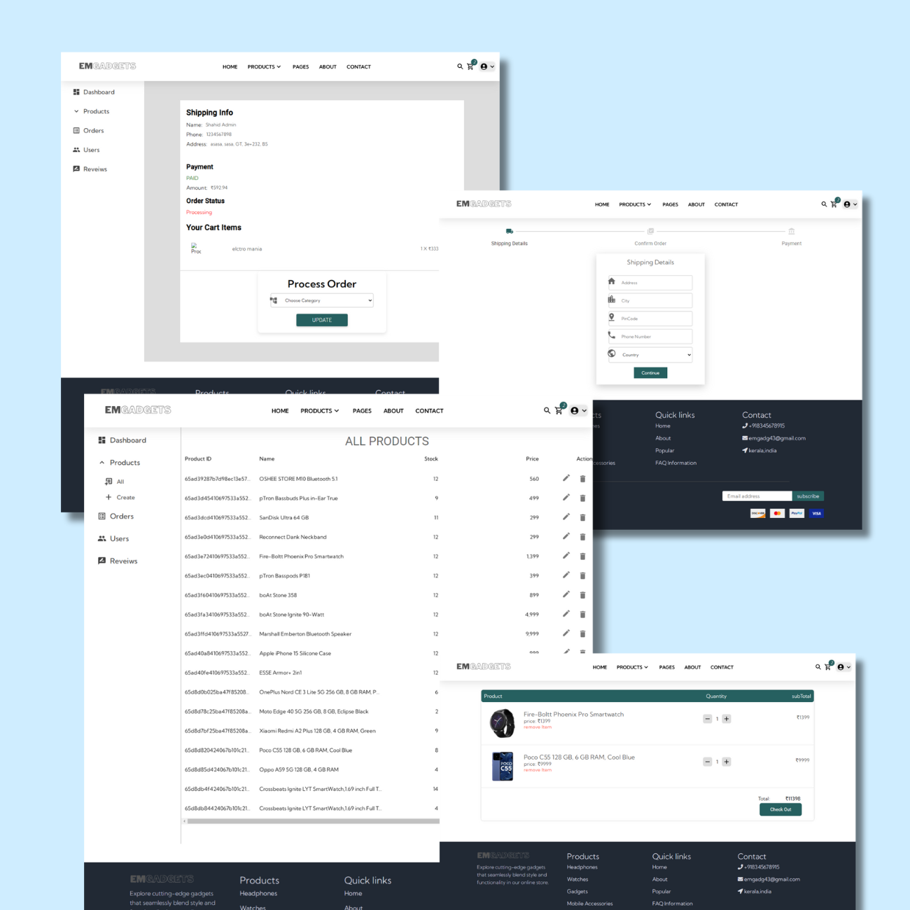

# EMGadgets - MERN Full Stack eCommerce Website

This is a Full-stack Ecommerce is built using the MERN stack, combining  React JS, Redux, Express JS, Node JS, MongoDB, Stripe to create a scalable e-commerce platform for electronic products.

## Screenshots




## Prerequisites

Before you begin, ensure you have met the following requirements:

* [Git](https://git-scm.com/downloads "Download Git") must be installed on your operating system.

## Installing EMGadgets

To install **EMGadgets**, follow these steps:

Linux and macOS:

```bash
sudo git clone https://github.com/Shahidclt93/EMGadgets_MERN_ecommerce_full_stack
```

Windows:

```bash
git clone https://github.com/Shahidclt93/EMGadgets_MERN_ecommerce_full_stack